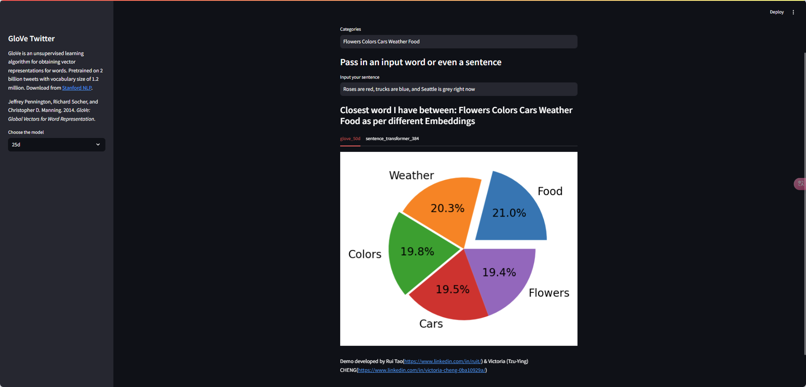
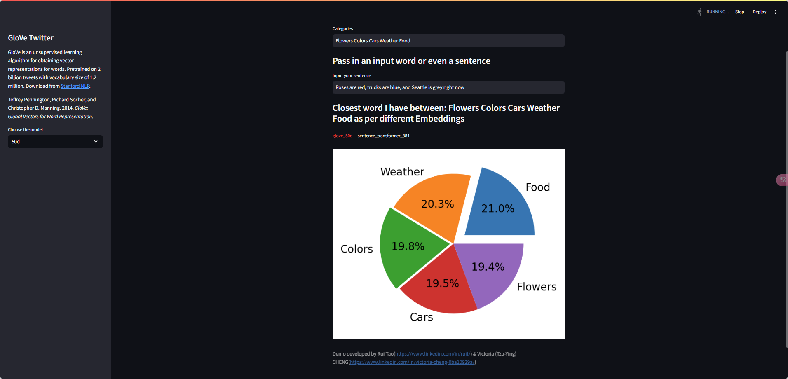
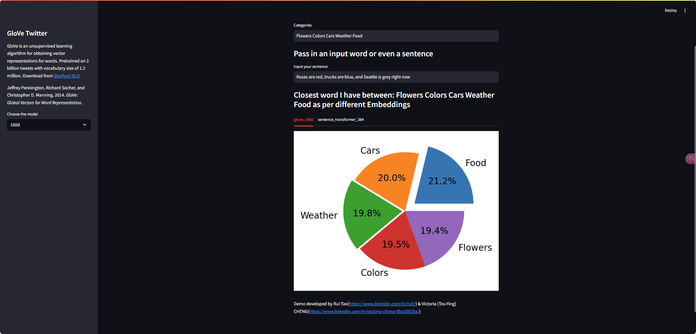
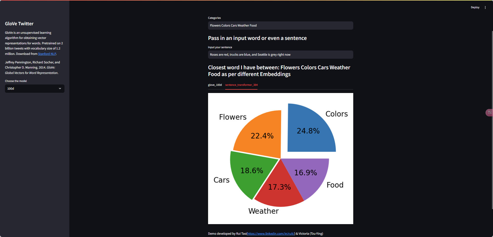

# Mini Project 1 - Text Similarity Search Documentation

## Team Information
Members:
1. Victoria (Tzu-Ying) Cheng
   - Implemented core algorithms (cosine_similarity, averaged_glove_embeddings_gdrive, get_sorted_cosine_similarity)
   - Conducted basic testing

2. Rui Tao
   - Tested and debugged the code
   - Deployed web application on Local Machine
   - Created documentation and test cases

## 1. Implementation Overview

### 1.1 Core Functions
```python
# Task I: Cosine Similarity (20 points)
def cosine_similarity(x, y):
    """
    Calculates exponentiated cosine similarity between two vectors
    """
    norm_x = np.linalg.norm(x)
    norm_y = np.linalg.norm(y)

    if norm_x == 0 or norm_y == 0:
        return 0

    cosine_sim = np.dot(x, y) / (norm_x * norm_y)
    exp_cosine_sim = math.exp(cosine_sim)

    return exp_cosine_sim

# Task II: GloVe Embeddings (30 points)
def averaged_glove_embeddings_gdrive(sentence, word_index_dict, embeddings, model_type=50):
    """
    Calculates averaged GloVe embeddings for input sentence
    """
    embedding = np.zeros(int(model_type.split("d")[0]))
    word_count = 0
    words = sentence.split()

    for word in words:
        lower_word = word.lower()
        word_index = word_index_dict.get(lower_word)
        if word_index is not None:
            word_embedding = embeddings[word_index]
            if np.any(word_embedding):
                embedding += word_embedding
                word_count += 1

    if word_count > 0:
        embedding /= word_count

    return embedding

# Task III: Similarity Sorting (50 points)
def get_sorted_cosine_similarity(embeddings_metadata):
    """
    Calculates and sorts similarities between input and categories
    """
    categories = st.session_state.categories.split(" ")
    cosine_sim = {}
    if embeddings_metadata["embedding_model"] == "glove":
        word_index_dict = embeddings_metadata["word_index_dict"]
        embeddings = embeddings_metadata["embeddings"]
        model_type = embeddings_metadata["model_type"]

        input_embedding = averaged_glove_embeddings_gdrive(st.session_state.text_search,
                                                            word_index_dict,
                                                            embeddings, model_type)
        
        for index, category in enumerate(categories):
            category_embedding = averaged_glove_embeddings_gdrive(category, word_index_dict, embeddings, model_type)
            cosine_sim[index] = cosine_similarity(input_embedding, category_embedding)

    else:
        model_name = embeddings_metadata["model_name"]
        if not "cat_embed_" + model_name in st.session_state:
            get_category_embeddings(embeddings_metadata)

        category_embeddings = st.session_state["cat_embed_" + model_name]

        print("text_search = ", st.session_state.text_search)
        if model_name:
            input_embedding = get_sentence_transformer_embeddings(st.session_state.text_search, model_name=model_name)
        else:
            input_embedding = get_sentence_transformer_embeddings(st.session_state.text_search)
        for index in range(len(categories)):
            category = categories[index]
            if category not in category_embeddings:
                category_embeddings[category] = get_sentence_transformer_embeddings(category, model_name=model_name)

            cosine_sim[index] = cosine_similarity(input_embedding, category_embeddings[category])
            
    sorted_cosine_sim = sorted(cosine_sim.items(), key=lambda x: x[1], reverse=True)
    return sorted_cosine_sim
```

## 2. Test Results

### 2.1 GloVe Models Test

Categories: "Flowers Colors Cars Weather Food"
Test Query: "Roses are red, trucks are blue, and Seattle is grey right now"

Results with different dimensions:

1. [GloVe 25d]


2. [GloVe 50d]


3. [GloVe 100d]


### 2.2 Sentence Transformer Test

Model: all-MiniLM-L6-v2


## 3. Web Application

### 3.1 Deployment (Bonus 10%)
- **URL**: [llm.ruit.me](https://llm.ruit.me/)
- **Platform**: Local Machine + Streamlit + Cloudflare Tunnel

### 3.2 Usage Guide
1. Access the application using the provided URL
2. Enter categories in the text input field (space-separated)
   - Example: "Flowers Colors Cars Weather Food"
3. Enter your search query
   - Example: "Roses are red, trucks are blue"
4. Select embedding model dimension (25d/50d/100d)
5. View results in the pie chart visualization

## 4. Dependencies
```python
# requirements.txt
name: llm596
channels:
  - pytorch
  - nvidia
  - conda-forge
  - defaults
dependencies:
  - python=3.11
  - pytorch
  - torchvision
  - torchaudio
  - pytorch-cuda=11.8
  - tensorflow-gpu
  - numpy
  - matplotlib
  - jupyter
  - pillow
  - pip
  - python-dotenv
  - streamlit
  - gdown
  - pip:
    - openai 
    - anthropic
    - IPython
    - sentence-transformers
```

## 5. Running Locally
```bash
# Install dependencies
pip install -r requirements.txt

# Run application
streamlit run HW2/Mini_Project_Part_1_soln.py
```
